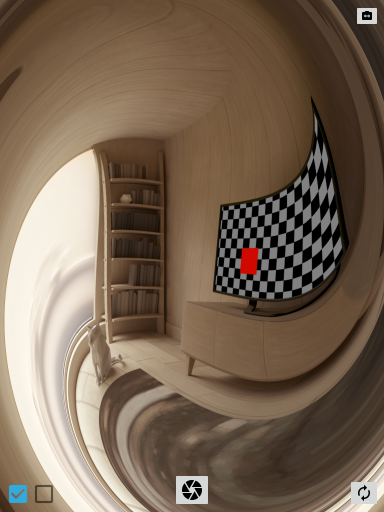

Distortion Camera
===

A camera app with distortion space in response to sensors.

### Prerequisites

- Minimum API Level ― API 24: Android 7.0 (Nougat)

### Usage

This app uses two sensors:

- Gyroscope sensor: It is active if the left checkbox is checked.
- Linear acceleration sensor: It is active if the right checkbox is checked.

### Info

This is a final assignment at [itspsdl](https://itspsdl.github.io/).

- [Presentation program (Japanese)](https://github.com/itspsdl/Demo2019)
